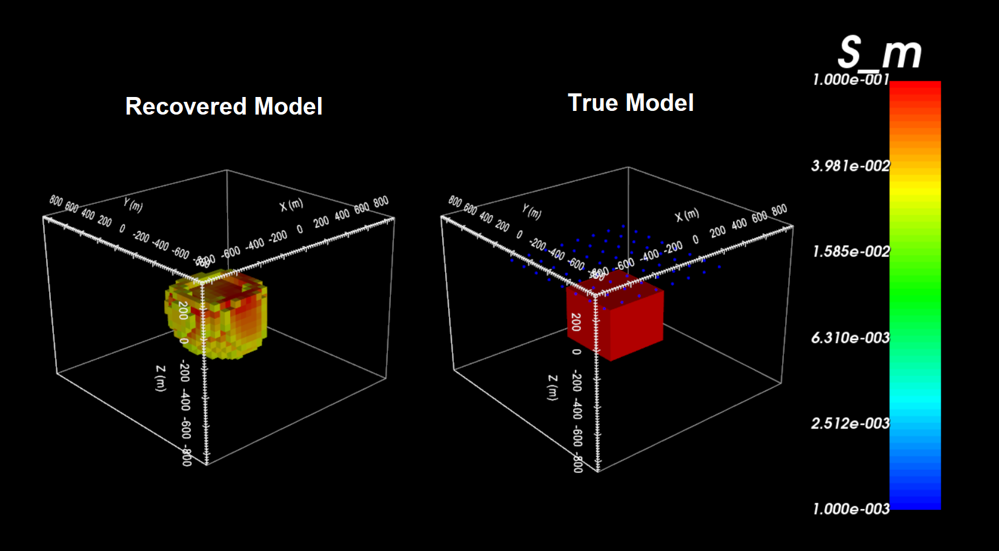

.. _example_inv:

Inversion
=========

Here, the code **h3dtdinv.exe** and the input file **h3dtdinv.inp** (:ref:`see format <h3dtd_input_inv>`) are used to invert dBz/dt data. TDEM data were created in the example ":ref:`forward modeling<example_fwd>`". Gaussian noise was added to the synthetic data. The noise had a standard deviation of 10\% the absolute value of each datum. Files relevant to this part of the example are in the sub-folder *inv*. Before running this example, you may want to do the following:

	- `Download and open the zip folder containing the entire H3DTD example <https://github.com/ubcgif/H3DTD/raw/h3dtd_v2/assets/h3dtd_example_dbzdt.zip>`__ (if not done already)
	- :ref:`Learn how to run code from command line <h3dtd_inv>`
	- :ref:`Learn the format of the input file <h3dtd_input_inv>`

To invert the synthetic data, the input file below was used:

.. figure:: ../inputfiles/images/inv_input.png
     :align: center
     :width: 700

The inversion reached the target data misfit on 4th trade-off parameter on the second Gauss-Newton iteration (**inv_04_02.con**). This model (left) and the true model (right) are shown below. A cutoff of 0.025 S/m has been used for both models.

