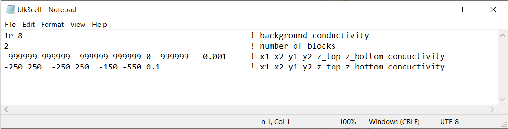
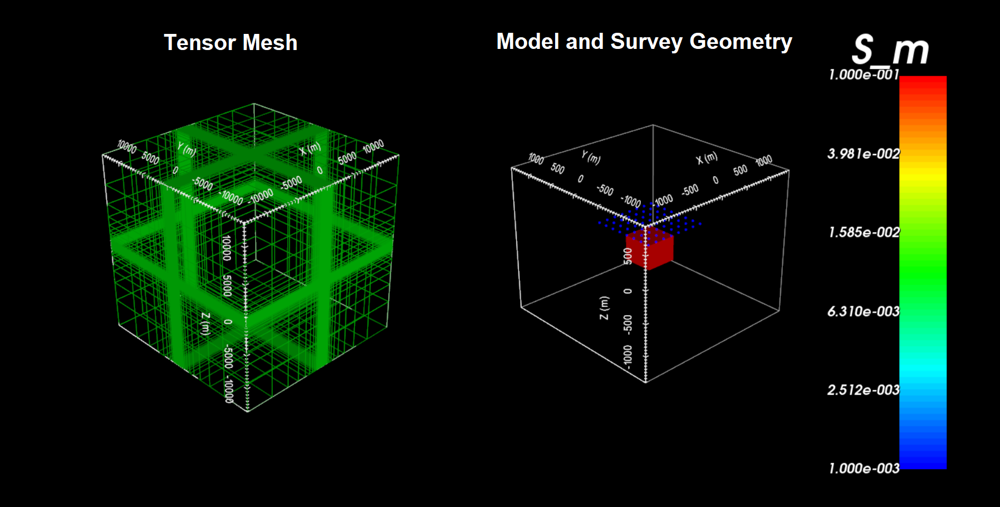

.. _example_model_galvanic:

Create Model
============

Here, the code **blk3cell.exe** and the input file **blk3cell.inp** (:ref:`see format <h3dtd_input_model>`) are used to create a conductivity model on the tensor mesh provided. Files relevant to this part of the example are in the sub-folder *tensor_model*. Before running this example, you may want to do the following:

	- `Download and open the zip folder containing the entire H3DTD example <https://github.com/ubcgif/h3dtd/raw/h3dtd_v2/assets/h3dtd_example_galvanic.zip>`__ (if not done already)
	- Learn how to run :ref:`blk3cell<h3dtd_model>` from command line
	- Learn the format of the input files :ref:`blk3cell.inp<h3dtd_input_model>`

Here is the input file for **blk3cell.exe**

The tensor mesh and resulting tensor model shows a conductive block (:math:`\sigma` = 0.1 S/m) within a more resistive background (:math:`\sigma_b` = 0.001 S/m).

