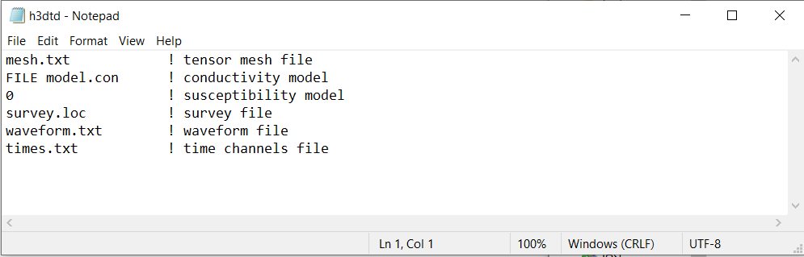
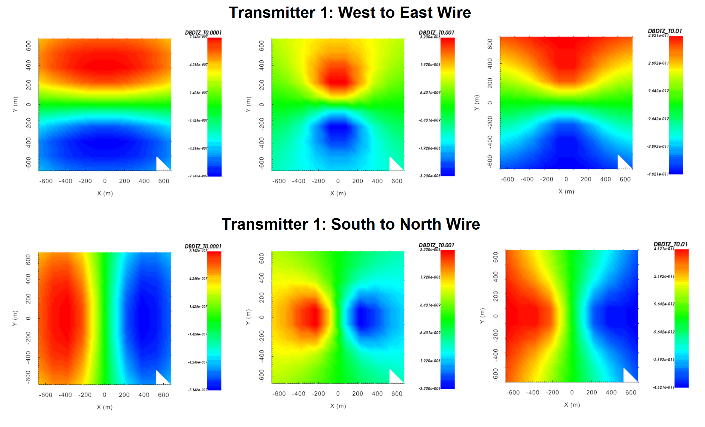

.. _example_fwd_galvanic:

Forward Modeling
================

Here, the code **h3dtd_v2.exe** and the input file **h3dtd.inp** (:ref:`see format <h3dtd_input_fwd>`) are used to forward model TEM data in the case of galvanic sources. The first source is a long wire that runs from (-775,0,0) to (775,0,0). The second source is a long wire the runs from (0,-775,0) to (0,775,0). We are interested in the vertical dB/dt response from each source as a regular grid of locations 25 m above the Earth's surface. Files relevant to this part of the example are in the sub-folder *fwd*. For this example, we use the model that was created in the example ":ref:`create model<example_model_galvanic>`". Before running this example, you may want to do the following:

	- `Download and open the zip folder containing the entire H3DTD v2 example <https://github.com/ubcgif/H3DTD/raw/h3dtd_v2/assets/h3dtd_example_galvanic.zip>`__ (if not done already)
	- :ref:`Learn how to run code from command line <h3dtd_fwd>`
	- :ref:`Learn the format of the input file <h3dtd_input_fwd>`

To forward model the data, the following input file was used:

H3DTD v2 forward models the Cartesian components of the electric field, magnetic field and the time derivative of the magnetic flux density. Below, we show dBz/dt at 0.0001 s, 0.001 s and 0.01 due to step-off excitation.

