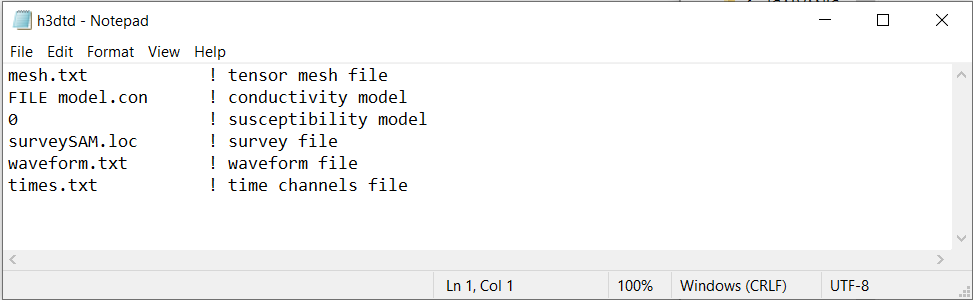
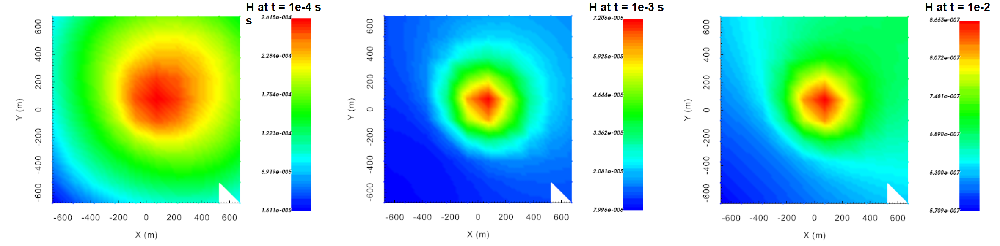

.. _example_sam_fwd:

Forward Modeling
================

Here, the code **h3dtd_v2.exe** and the input file **h3dtd.inp** (:ref:`see format <h3dtd_input_fwd>`) are used to forward model SAM data for a large loop transmitter on the Earth's surface. In this case, the Earth's field has an inclination of -60 degrees and a declination of 45 degrees; i.e. coming out of the Earth and pointing towards the Northwest. Files relevant to this part of the example are in the sub-folder *fwd*. For this example, we use the model that was created in the example ":ref:`create model<example_sam_model>`". Before running this example, you may want to do the following:

	- `Download and open the zip folder containing the entire H3DTD v2 example <https://github.com/ubcgif/h3dtd/raw/h3dtd_v2/assets/h3dtd_example_sam.zip>`__ (if not done already)
	- :ref:`Learn how to run code from command line <h3dtd_fwd>`
	- :ref:`Learn the format of the input file <h3dtd_input_fwd>`

To forward model the data, the following input file was used:

H3DTD v2 forward models the projection of the B-field along the direction of the Earth's magnetic field. Below, we show SAM data at 0.0001 s, 0.001 s and 0.01 due to step-off excitation.

