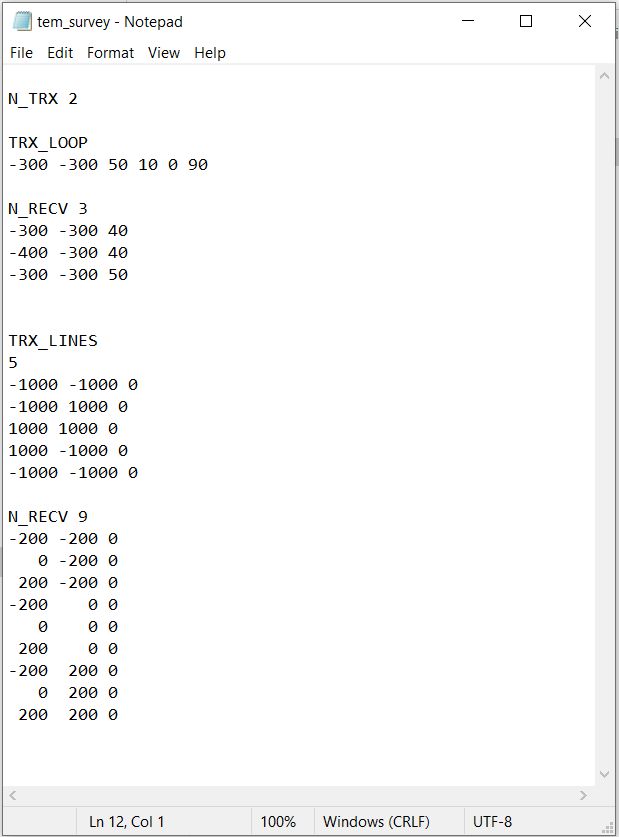

.. _surveyFile:

Locations File
==============

The locations file is used to predict synthetic field data (forward modeling) using **h3dtd_v2.exe**. This file defines the number of transmitters, transmitter geometry and the observation locations. Along with the :ref:`time gates file<gatesFile>`, this defines all necessary survey information.

.. note:: Bolded entries are fixed flags recognized by the Fortran codes and blue hyperlinked entries are values/regular expressions specified by the user

Standard TEM Data
-----------------

This is used to model the Cartesian components of the fields (E, H and dB/dt). The lines of the survey file in this case are formatted as follows:

|
| **N_TRX** :math:`\;` :ref:`n_trx<h3dtd_survey_ln1>`
|
| :ref:`DEFINE TRANSMITTER<h3dtd_survey_transmitter>`
| 
| **N_RECV** :math:`\;` :ref:`n_recv<h3dtd_survey_ln2>`
| :math:`\;\;` :ref:`Locations Array<h3dtd_survey_ln3>`
|
| :ref:`DEFINE TRANSMITTER<h3dtd_survey_transmitter>`
|
| **N_RECV** :math:`\;` :ref:`n_recv<h3dtd_survey_ln2>`
| :math:`\;\;` :ref:`Locations Array<h3dtd_survey_ln3>`
|
|
| :math:`\;\;\;\;\;\; \vdots`
|
|
| :ref:`DEFINE TRANSMITTER<h3dtd_survey_transmitter>`
|
| **N_RECV** :math:`\;` :ref:`n_recv<h3dtd_survey_ln2>`
| :math:`\;\;` :ref:`Locations Array<h3dtd_survey_ln3>`
|
| *Repeat for number of unique transmitters*
|
|

     Example survey file with various types of transmitters.

TEM SAM Data
------------

This is used to model the Sub-audio magnetic (SAM) data. The lines of the survey file in this case are formatted as follows:

|
| **B0** :math:`\;` :ref:`vx vy vz<h3dtd_survey_ln0>`
| **N_TRX** :math:`\;` :ref:`n_trx<h3dtd_survey_ln1>`
|
| :ref:`DEFINE TRANSMITTER<h3dtd_survey_transmitter>`
| 
| **N_RECV** :math:`\;` :ref:`n_recv<h3dtd_survey_ln2>`
| :math:`\;\;` :ref:`Locations Array<h3dtd_survey_ln3>`
|
| :ref:`DEFINE TRANSMITTER<h3dtd_survey_transmitter>`
|
| **N_RECV** :math:`\;` :ref:`n_recv<h3dtd_survey_ln2>`
| :math:`\;\;` :ref:`Locations Array<h3dtd_survey_ln3>`
|
|
| :math:`\;\;\;\;\;\; \vdots`
|
|
| :ref:`DEFINE TRANSMITTER<h3dtd_survey_transmitter>`
|
| **N_RECV** :math:`\;` :ref:`n_recv<h3dtd_survey_ln2>`
| :math:`\;\;` :ref:`Locations Array<h3dtd_survey_ln3>`
|
| *Repeat for number of unique transmitters*
|
|

Parameter Descriptions
----------------------

.. _h3dtd_survey_ln0:

    - **vx vy vz:** The x, y and z components of the unit vector defining the direction of the Earth's magnetic field. This line is only used when modeling SAM data.

.. _h3dtd_survey_ln1:

    - **n_trx:** The total number of unique transmitters. Example: *N_TRX 3*

.. _h3dtd_survey_ln2:

    - **n_recv:** The number of receivers collecting field observations for a particular transmitter.

.. _h3dtd_survey_ln3:

    - **Locations Array:** Contains the X (Easting), Y (Northing), Z (elevation) locations for all receivers associated with a particular transmitter. The TEM response will be predicted at all times defined in the :ref:`time gates file <gatesFile>` . Thus for a single given transmitter, the locations array is organized as follows:

|
|  :math:`x_1 \;\; y_1 \;\; z_1`
|  :math:`x_2 \;\; y_2 \;\; z_2`
|  :math:`x_3 \;\; y_3 \;\; z_3`
|  :math:`x_4 \;\; y_4 \;\; z_4`
|  :math:`x_5 \;\; y_5 \;\; z_5`
|  :math:`\; \vdots \;\;\;\;\, \vdots \;\;\;\;\, \vdots`
|  :math:`x_n \; y_n \; z_n`
|
|

.. _h3dtd_survey_transmitter:

Defining Transmitters
---------------------

There are two types of transmitters that *TDoctree* survey files can use

Circular loop transmitter
~~~~~~~~~~~~~~~~~~~~~~~~~

This is an inductive source. The circular loop transmitter is defined using two lines:

|
| *TRX_LOOP*
| :math:`x \;\; y \;\; z \;\; R \;\; \theta \;\; \alpha`
|
|

where

    - *TRX_LOOP* is a flag that must be entered
    - :math:`x` is the Easting, :math:`y` is the Northing and :math:`z` is the elevation location of the center of the loop
    - :math:`R` is the radius of the loop
    - :math:`\theta` is the azimuthal angle in degrees. A horizontal loop is defined by :math:`\theta = 0`
    - :math:`\alpha` is the clockwise angle from northing in degrees

Large inductive source
~~~~~~~~~~~~~~~~~~~~~~

Here, we define the inductive source using a set of wire segments. When defining this type of transmitter, you **must** close the loop. The block defining this transmitter is given by:

|
| *TRX_LINES*
| :math:`N`
| :math:`x_1 \;\;\; y_1 \;\;\; z_1`
| :math:`x_2 \;\;\; y_2 \;\;\; z_2`
| :math:`\; \vdots \;\;\;\;\;\, \vdots \;\;\;\;\;\, \vdots`
| :math:`x_N \;\; y_N \;\; z_N`
| 
|

where

    - *TRX_LINES* is a flag that must be entered
    - :math:`N` is the number of nodes (# segments - 1)
    - :math:`x_i, \; y_i \; z_i` are Easting, Northing and elevation locations for the nodes

