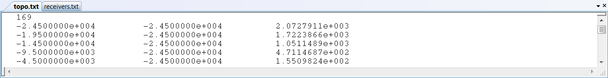

.. _topoFile:

Topography Data
===============

Surface topography is defined in a file as a cluster of points. In the topography file, the first line states the number of points used to define the topography. The subsequent rows provide the (x,y,z) position for each point. 

     Example topography file

