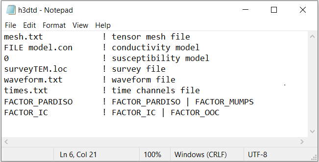

.. _h3dtd_input_fwd:

Forward Input File
==================

The forward problem is solved using the executable program **h3dtd_v2.exe**. The lines of input file are as follows:

.. tabularcolumns:: |L|C|C|

+--------+--------------------------------------------------------------+----------------------------------------------------+
| Line # | Description                                                  | Description                                        |
+========+==============================================================+====================================================+
| 1      | :ref:`Tensor Mesh<h3dtd_input_inv_ln1>`                      | path to tensor mesh file                           |
+--------+--------------------------------------------------------------+----------------------------------------------------+
| 2      | :ref:`Conductivity Model<h3dtd_input_inv_ln2>`               | conductivity model                                 |
+--------+--------------------------------------------------------------+----------------------------------------------------+
| 3      | :ref:`Susceptibility Model (optional)<h3dtd_input_inv_ln3>`  | susceptibility model                               |
+--------+--------------------------------------------------------------+----------------------------------------------------+
| 4      | :ref:`Locations File<h3dtd_input_inv_ln4>`                   | defines the survey geometry                        |
+--------+--------------------------------------------------------------+----------------------------------------------------+
| 5      | :ref:`Waveform File<h3dtd_input_inv_ln5>`                    | defines transmitter waveform and time-stepping     |
+--------+--------------------------------------------------------------+----------------------------------------------------+
| 6      | :ref:`Time Gates File<h3dtd_input_inv_ln6>`                  | defines the observation times for predicted data   |
+--------+--------------------------------------------------------------+----------------------------------------------------+

    Example input file for the inversion program (`Download <https://github.com/ubcgif/H3DTD/raw/main/assets/input_files/h3dtd.inp>`__ ). 

Line Descriptions
^^^^^^^^^^^^^^^^^

.. _h3dtd_input_inv_ln1:

    - **Tensor Mesh:** file path to the :ref:`tensor mesh<tensorFile>` file

.. _h3dtd_input_inv_ln2:

    - **Conductivity Model:** Defines the conductivity model for the forward problem. There are two options:

        - *FILE filepath:* The user enters the flag *FILE* followed by the path to the conductivity :ref:`model file<modelFile>`
        - *VALUE val:* The user enters the flag *VALUE* followed by a value representing the conductivity of a wholespace model; e.g. we are modeling a wholespace if this option is used.

.. _h3dtd_input_inv_ln3:
    
    - **Susceptibility Model:** Defines the conductivity model for the forward problem. There are two options:

        - *0:* A flag of *0* is entered if the susceptibility within the domain is zero
        - *FILE filepath:* The user enters the flag *FILE* followed by the path to the susceptibility :ref:`model file<modelFile>`
        - *VALUE val:* The user enters the flag *VALUE* followed by a value representing the susceptibility of a wholespace model; e.g. the same susceptibility value is assigned to every cell

.. _h3dtd_input_inv_ln4:

    - **Locations File:** Provide the path to the :ref:`locations file<surveyFile>`

.. _h3dtd_input_inv_ln5:
    
    - **Wave File:** Provide the path to the :ref:`wave file<waveFile>`. This file defines the transmitter current and time-stepping for the problem.

.. _h3dtd_input_inv_ln6:

    - **Time Gates File:** Provide the path to the :ref:`time gates file<gatesFile>`. This file defines the times at which the TEM data are measured for the forward problem.
