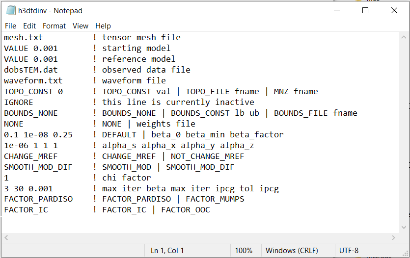

.. _h3dtd_input_inv:

Inversion Input File
====================

The inverse problem is solved using the executable program **h3dtdinv_v2.exe**. The lines of input file are as follows:

.. tabularcolumns:: |L|C|C|

+--------+-------------------------------------------------------------------+--------------------------------------------------------------+
| Line # | Description                                                       | Description                                                  |
+========+===================================================================+==============================================================+
| 1      | :ref:`Tensor Mesh<h3dtd_input_inv_ln1>`                           | path to tensor mesh file                                     |
+--------+-------------------------------------------------------------------+--------------------------------------------------------------+
| 2      | :ref:`Initial Model<h3dtd_input_inv_ln2>`                         | initial model                                                |
+--------+-------------------------------------------------------------------+--------------------------------------------------------------+
| 3      | :ref:`Reference Model<h3dtd_input_inv_ln3>`                       | reference model                                              |
+--------+-------------------------------------------------------------------+--------------------------------------------------------------+
| 4      | :ref:`Observations File<h3dtd_input_inv_ln4>`                     | path to observations file                                    |
+--------+-------------------------------------------------------------------+--------------------------------------------------------------+
| 5      | :ref:`Wave File<h3dtd_input_inv_ln5>`                             | sets time steps for the time-dependent problem               |
+--------+-------------------------------------------------------------------+--------------------------------------------------------------+
| 6      | :ref:`Active Topography Cells<h3dtd_input_inv_ln6>`               | topography                                                   |
+--------+-------------------------------------------------------------------+--------------------------------------------------------------+
| 7      | :ref:`IGNORE<h3dtd_input_inv_ln7>`                                | currently ignored by program                                 |
+--------+-------------------------------------------------------------------+--------------------------------------------------------------+
| 8      | :ref:`Bounds<h3dtd_input_inv_ln8>`                                | upper and lower bounds for recovered model                   |
+--------+-------------------------------------------------------------------+--------------------------------------------------------------+
| 9      | :ref:`Weights<h3dtd_input_inv_ln9>`                               | additional cell weights                                      |
+--------+-------------------------------------------------------------------+--------------------------------------------------------------+
| 10     | :ref:`beta_max beta_min beta_factor<h3dtd_input_inv_ln10>`        | cooling schedule for beta parameter                          |
+--------+-------------------------------------------------------------------+--------------------------------------------------------------+
| 11     | :ref:`alpha_s alpha_x alpha_y alpha_z<h3dtd_input_inv_ln11>`      | weighting constants for smallness and smoothness constraints |
+--------+-------------------------------------------------------------------+--------------------------------------------------------------+
| 12     | :ref:`Reference Model Update<h3dtd_input_inv_ln12>`               | reference model update                                       |
+--------+-------------------------------------------------------------------+--------------------------------------------------------------+
| 13     | :ref:`Hard Constraints<h3dtd_input_inv_ln13>`                     | use *SMOOTH_MOD* or *SMOOTH_MOD_DIFF*                        |
+--------+-------------------------------------------------------------------+--------------------------------------------------------------+
| 14     | :ref:`Chi Factor<h3dtd_input_inv_ln14>`                           | stopping criteria for inversion                              |
+--------+-------------------------------------------------------------------+--------------------------------------------------------------+
| 15     | :ref:`iter_per_beta tol_ipcg max_iter_ipcg<h3dtd_input_inv_ln15>` | parameters for Gauss-Newton iterations                       |
+--------+-------------------------------------------------------------------+--------------------------------------------------------------+

     Example input file for the inversion program (`Download <https://github.com/ubcgif/H3DTD/raw/main/assets/input_files/h3dtdinv.inp>`__ ).

Line Descriptions
^^^^^^^^^^^^^^^^^

.. _h3dtd_input_inv_ln1:

    - **Tensor Mesh:** file path to the :ref:`tensor mesh<tensorFile>` file

.. _h3dtd_input_inv_ln2:

    - **Initial Model:** Defines the starting conductivity model for the inversion. There are two options:

        - *FILE filepath:* The user enters the flag *FILE* followed by the path to a conductivity :ref:`model file<modelFile>`
        - *VALUE val:* The user enters the flag *VALUE* followed by a value representing the conductivity of all cells lying below the surface topography

.. _h3dtd_input_inv_ln3:
    
    - **Reference Model:** Defines the reference conductivity model for the inversion. There are two options:

        - *FILE filepath:* The user enters the flag *FILE* followed by the path to a conductivity :ref:`model file<modelFile>`
        - *VALUE val:* The user enters the flag *VALUE* followed by a value representing the conductivity of all cells lying below the surface topography

.. _h3dtd_input_inv_ln4:
    
    - **Observations File:** Set the path to a :ref:`observations file<obsFile>`. The observations file defines the survey geometry, observed data and uncertainties.

.. _h3dtd_input_inv_ln5:
    
    - **Wave File:** Set the path to a :ref:`wave file<waveFile>`. This file defines transmitter current and the time-stepping for the problem.

.. _h3dtd_input_inv_ln6:

    - **Active Topography Cells:** Here, the user can choose to specify the cells which lie below the surface topography. To do this, the user may supply the file path to an active cells model file or type "ALL_ACTIVE". The active cells model has values 1 for cells lying below the surface topography and values 0 for cells lying above.

.. _h3dtd_input_inv_ln7:

    - **IGNORE:** Enter the flag IGNORE. This line is currently not used by the inversion code

.. _h3dtd_input_inv_ln8:

    - **Bounds:** Bound constraints on the recovered model. There are 3 options:

       - *BOUNDS_NONE:* the flag BOUNDS_NONE is provided if there are no bounds on the recovered model
       - *BOUNDS_CONST lb ub:* the flag BOUNDS_CONST is entered followed by a lower and an upper bound value that will be applied to all cells; e.g. "BOUNDS_CONST 1E-6 0.1"
       - *BOUNDS_FILE filepath:* the flag BOUNDS_FILE is entered followd by the path to a :ref:`bounds file<boundsFile>`

.. _h3dtd_input_inv_ln9:

    - **Weights:** Here, the user specifies whether additional weights are supplied. If no additional weights are being supplied, enter the flag *NONE*. To apply weights, supply the path to a :ref:`weights file <weightsFile>`.

.. _h3dtd_input_inv_ln10:

    - **beta_max beta_min beta_factor:** Here, the user specifies protocols for the trade-off parameter (beta). *beta_max* is the initial value of beta, *beta_min* is the minimum allowable beta the program can use before quitting and *beta_factor* defines the factor by which beta is decreased at each iteration; example "1E4 10 0.2". The user may also enter *DEFAULT* if they wish to have beta calculated automatically.

.. _h3dtd_input_inv_ln11:

    - **alpha_s alpha_x alpha_y alpha_z:** `Alpha parameters <http://giftoolscookbook.readthedocs.io/en/latest/content/fundamentals/Alphas.html>`__ . Here, the user specifies the relative weighting between the smallness and smoothness component penalties on the recovered models.

.. _h3dtd_input_inv_ln12:

    - **Reference Model Update:** Here, the user specifies whether the reference model is updated at each inversion step result. If so, enter *CHANGE_MREF*. If not, enter *NOT_CHANGE_MREF*.

.. _h3dtd_input_inv_ln13:

    - **Hard Constraints:** if the flag *SMOOTH_MOD* is used, the reference model is not included in the smoothness terms of the model objective function; i.e. we preserve structures in the reference model but not their boundaries. If the flag "SMOOTH_MOD_DIF" is used, the reference model is included in the smallness and smoothness terms of the model objective function; i.e. we preserve the structures and boundaries defined in the reference model. For more, see the `GIFtools cookbook <https://giftoolscookbook.readthedocs.io/en/latest/content/fundamentals/MrefInSmooth.html>`__ .

.. _h3dtd_input_inv_ln14:

    - **Chi Factor:** The chi factor defines the target misfit for the inversion. A chi factor of 1 means the target misfit is equal to the total number of data observations.

.. _h3dtd_input_inv_ln15:

    - **iter_per_beta max_iter_ipcg tol_ipcg:** Here, *iter_per_beta* is the number of Gauss-Newton iterations performed for each beta value; see :ref:`cooling schedule <theory_cooling>`. *max_iter_ipcg* is the maximum number of iterations for the incomplete-preconditioned-conjugate gradient solve of the Gauss-Newton system, and *tol_ipcg* defines the tolerance (stopping criteria); see :ref:`Gauss-Newton solve<theory_IPCG>`