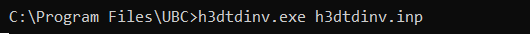

.. _h3dtd_inv:

Inversion Program
=================

The inversion is carried out using the **h3dtdinv.exe** executable program and an input file that MUST be name **h3dtdinv.inp**. To run the executable, open a command window and type the following:

Units
^^^^^

    - **Electric field data:** *Ex*, *Ey* and *Ez* in units V/m
    - **Magnetic field data:** *Hx*, *Hy* and *Hz* in units A/m. 
    - **Magnetic field data:** *dBx/dt*, *dBy/dt* and *-dBz/dt* in units T/s. The vertical component of dB/dt is represented using -dBz/dt due to a long-standing plotting convention 
    - **Conductivity model:** S/m
    - **Reference/starting conductivity model:** S/m 
    - **Model/interface weights:** unitless

.. important:: Any combination of data, electric and or magnetic field components, can be be inverted. A specified flag at the start of the observations file can be used to omit columns or individual datums.

Output Files
^^^^^^^^^^^^

The program **h3dtdinv.exe** creates the following output files:

    - **dpred_0.txt** data predicted using the starting model or forward model

    - **inv_xx.con:** recovered model at iteration 'xx'

    - **dpred_xx.txt** data predicted using model 'xx'

    - **inv.con:** final conductivity model

    - **h3dtd.log:** log file for the inversion

    - **h3dtd.out:** stores details regarding the inversion

